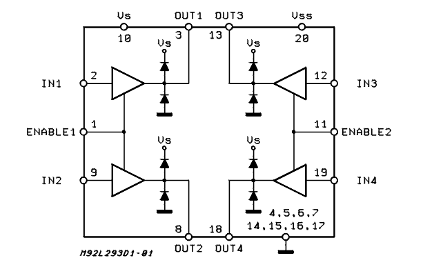
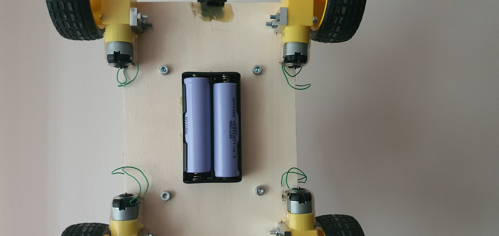
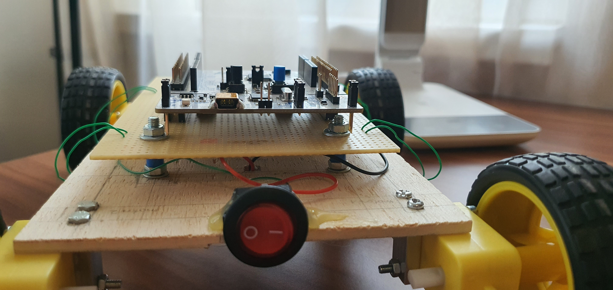
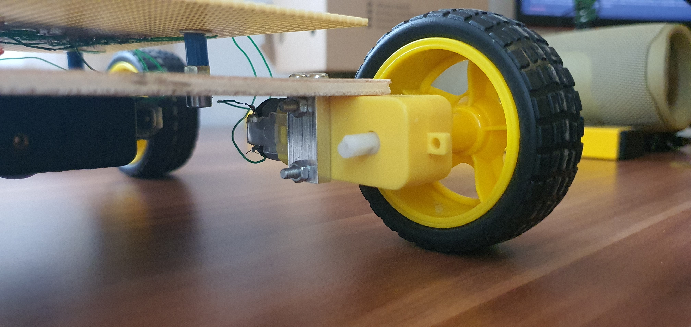
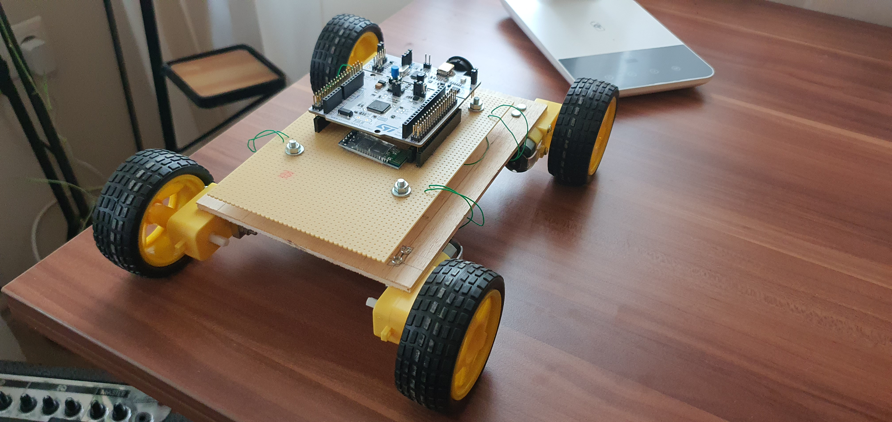

# ARMobile Documentation
2021.05.21

## Developers
  - Csókás Bence
  - Koloszár Gergely

## Specification

The main goal was to create a simple model car, that can be controlled remotely, without any wires.

## Hardware:

The model can be separated into 3 layers:
  - STM32 based Nucleo board
  - driver electronics
  - base board, and mechanics

### Microcontroller

The central microcontroller is chosen to be an `STM32F303RE`. For a first project, this controller has enough computing capacity to handle any task that might emerge, and leaves room for improvement. The board type is a `nucleo-64` board, which is small enough to be fit for a project like this, but still comfortable to work with.

### Motor driver electronics

Considering the required capabilities, the optimal choice seemed to be two `L293D` circuits. These are simple motor driver ICs containing two modules each. Each module has three inputs and two outputs, pins with the following functions:
  - outputs 1 and 2 are connected to the motors pins
  - inputs 1 and 2 are the inputs for the output amplifiers, therefore they control the direction of the rotation.
  - enable input simply enables the two output amplifiers, and makes it easier to regulate the speed with PWM signals

  <!--picture-->


Each IC contains two of these drivers, as the picture shows, therefore, two ICs are required to drive the four motors. To ensure that the motors on one side always rotate in the same direction, with the same speed, the appropriate input and enable pins are connected to each other.

The two ICs, pin arrays for the Nucleo and the wiring are mounted on test-PCB, which functions as the base for the electronics. The whole PCB is held in place by four screws, and mounted on a wooden board.

For wireless communication with the board, a `HC-05` module was also connected to the PCB. This small module provides Bluetooth connectivity, by converting `RFCOMM` Bluetooth messages into standard TTL-level `8N1 UART` signals on its RX and TX pins. This module is used to remotely control the movement of the vehicle.

### Mechanical layer

The mechanical base for this project was a small wooden board. Four small DC motors (RM-17) are mounted onto this board, and the PCB is secured to it with four screws. The main power source is located on the bottom of the cart. To have enough driving voltage, two 18650 Li-Ion cells, connected in series, were installed on board. They provide 7.2 V for the motors, and are used as the primary source of power for the controller as well. A simple power switch is installed onto the back of the vehicle, which can remove power entirely from the system.


#### Batteries:


#### Power switch:


#### Motors:


#### The finished hardware:


## Software

The main software was created using STMicroelectronics' `CubeIDE`. Initial code generation was done with `Cube-MX`. HAL drivers are used throughout the whole project.

### Used peripherals:
  - USART2:   USART over USB debug interface (integrated ST-Link on the Nucleo)
  - USART3:   Bluetooth communication interface
  - TIMER2:   PWM generation for the left side wheels
  - TIMER3:   PWM generation for the right side wheels
  - GPIO:     Direction control for all motors


`USART2` and `USART3` modules are used in interrupt mode, so the processor will be available if any other task is to be implemented in the future.

### Control system

The control system operates on the two sides of the vehicle, not individual motors. Functions are implemented to set the speed, and direction of the two-two motors on each side.
Upon receiving a character from the serial terminal (from Bluetooth or ST-Link), the controller decides what to do in a switch-case block. The main state variable stored in memory is only speed, no direction information is stored.

Enums are created for readability and easier understanding:
```c
typedef enum DirectionTypeDef{
	FORWARD,
	BACKWARD
}DirectionTypeDef;

enum speed{
	slow = 30,
	normal = 60,
	fast = 90
}speedMode = slow;
```

The `DirectionTypeDef` is a convenience `enum` in the following functions, to make handling directions easier.

The `speedMode`, is a global variable containing information about the speed of the vehicle, and defining legal speed values. Speed control is implemented as setting the duty cycle for each timer, the values represent percentages.

#### Functions available:

```c
static void Stop(void);

inline static void Set_Speed_Right(uint8_t);		// 0 <= param < 100
inline static void Set_Speed_Left(uint8_t); 		// 0 <= param < 100

inline static void Set_Speed(uint8_t);

static void Set_Dir_Right(DirectionTypeDef);
static void Set_Dir_Left(DirectionTypeDef);
```

The functions do exactly what their name says:

 - `Stop()` is stopping every mortor, and sets duty cycle to 0.
 - `Set_Speed()` sets the speed on both sides, by calling each side's setter functions.

In theory, the speed functions accept any integer between 0 and 100, but the Bluetooth control code only uses the given values, as defined in `enum speed`.
